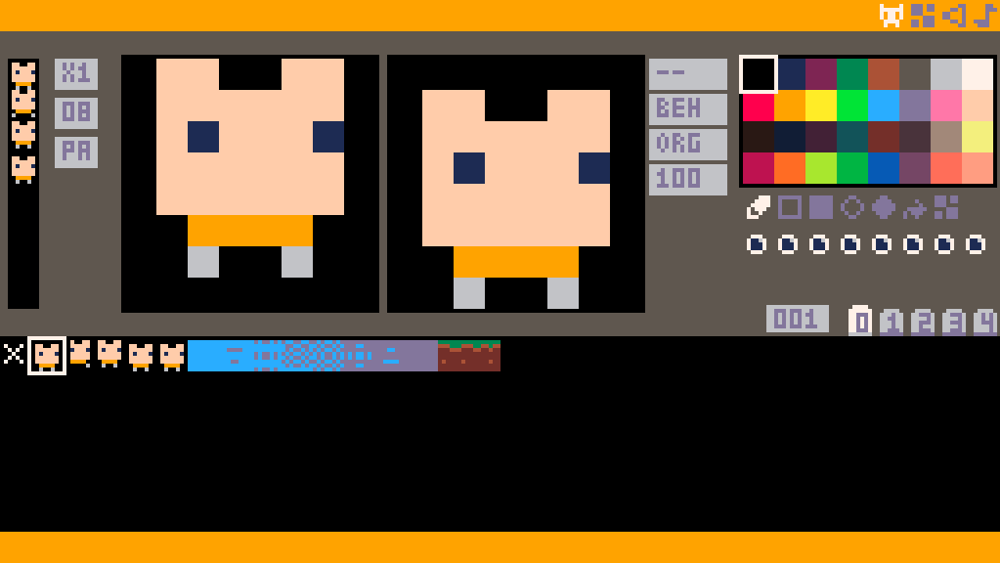
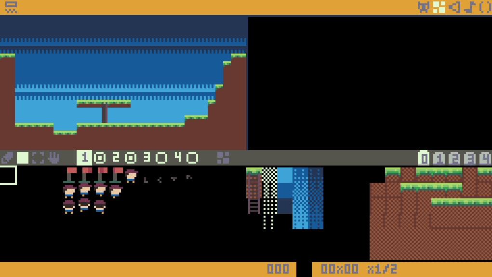
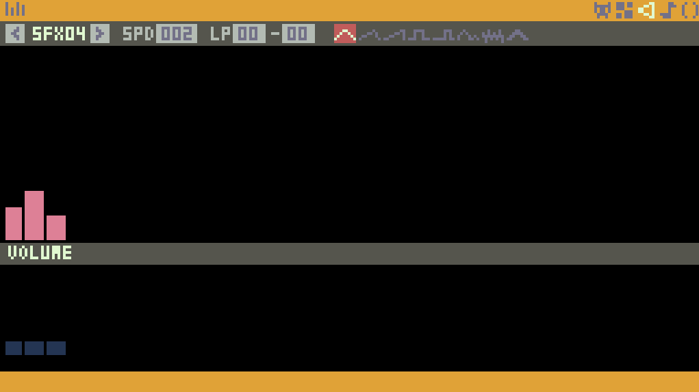
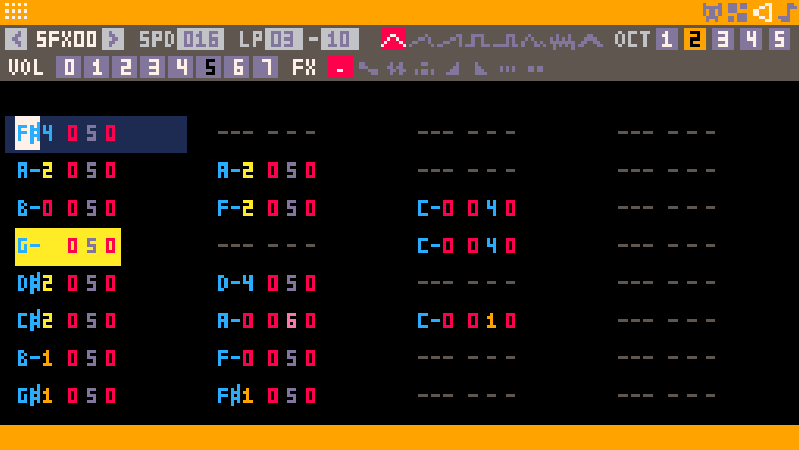
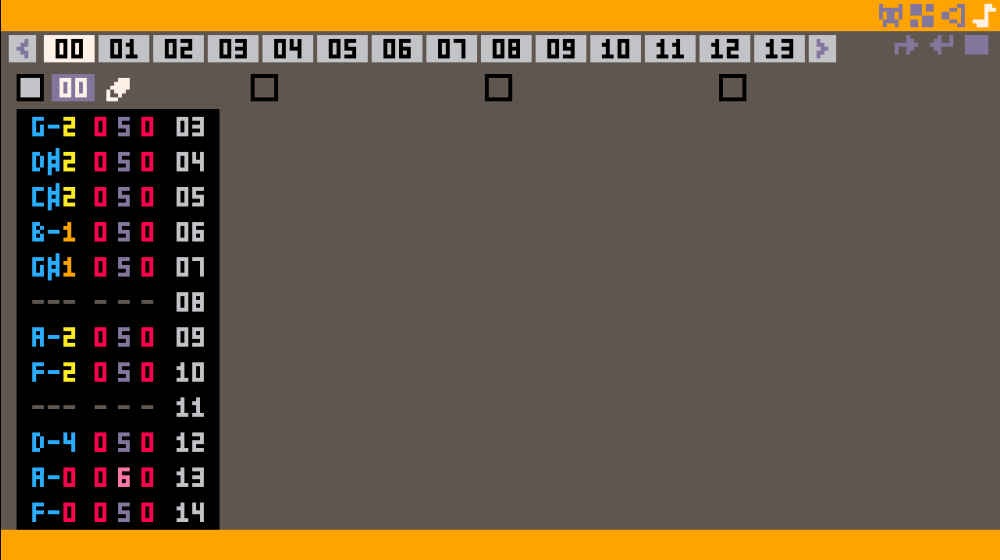
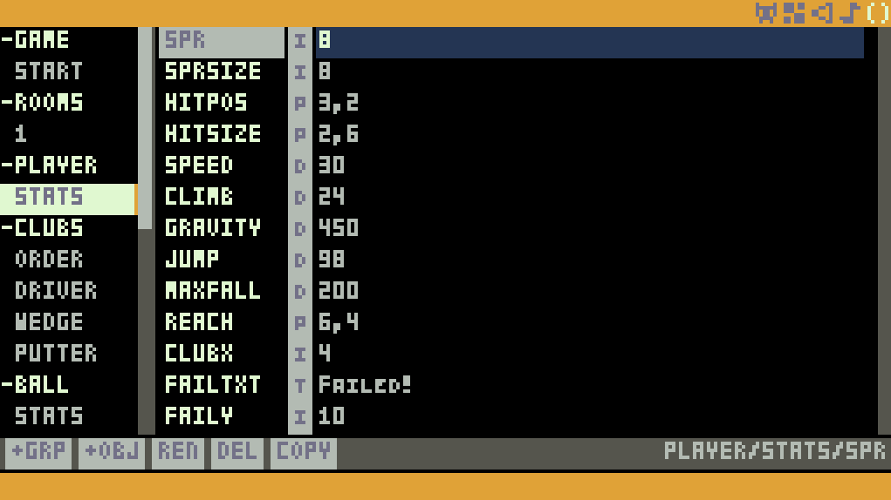
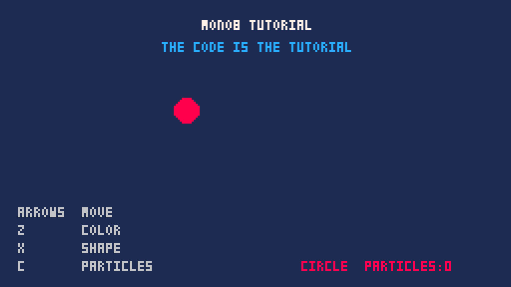

# Mono8

A PICO-8 style game engine built on MonoGame (.NET 8), with built-in sprite, map, sfx, music and json data editors. The screen is 256×144 pixels with a 32-color palette.

## Download

https://mono8games.itch.io/mono8

## Building

The project file lives in [src/](src/), so run from the repository root:

### Commands

```
dotnet build src/mono8.csproj
```

```
dotnet publish src/mono8.csproj -c Release -r win-x64 --self-contained true -p:PublishSingleFile=true
```

```
dotnet publish src/mono8.csproj -c Release -r linux-arm64 --self-contained true -p:PublishSingleFile=true
```

### Getting your assets into a build

A build does **not** pick up the authored project automatically. The engine only ever reads the `data/` folder sitting next to the executable it is running, so after building you have to **copy every file from [src/publishdata/](src/publishdata/) into that folder**, replacing what is there — otherwise the sprites, map, sfx, music and json come up empty.

Where that folder is depends on the configuration you built:

| Build | Copy `src/publishdata/*` into |
|---|---|
| `dotnet build` (Debug) | `src/bin/Debug/net8.0/data/` |
| `dotnet build -c Release` | `src/bin/Release/net8.0/data/` |
| `dotnet publish` | `data/` next to the published executable |

The same goes the other way round: `Ctrl+S` in an editor writes to the `data/` folder of the executable you are running, and mirrors it back into `src/publishdata/` — see [Where a save lands](#where-a-save-lands). So `src/publishdata/` is always the authored copy, and every build's `data/` is a disposable one you refresh from it.

`data.save` is the exception — it is runtime persistence written by `dset`, not authored data, so leave each build's own copy alone.

## Images

### Sprite Editor

 

### Map Editor

 

### Sfx Editor View 1

 

### Sfx Editor View 2



### Music Editor



### Json Editor



### Ctrl + R to go to YourGame and Esc to go back to Editors



## Specs

| | |
|---|---|
| Screen | 256×144 pixels, 32 colors |
| Sprite sheet | 256×240 pixels — 32×30 tiles of 8×8, so sprite ids `0`-`959` |
| Map | 512×576 cells |
| Sound | 64 SFX, 64 music patterns, 4 channels |
| Persistence | 64 integer slots |

Color indices `0`-`31` have names in `Constants.Colors` (`Constants.Colors.DarkBlue` is `1`, and so on). Sprite `0` is the empty sprite: `map` never draws it, and color `0` is transparent by default.

## Editors

On launch a short splash screen plays, then the Sprite editor opens. The icon buttons at the **top-right of the menu bar** switch between the five editors: **Sprite**, **Map**, **Sfx**, **Music** and **Json**. The button at the top-left is context-sensitive — it toggles the full-screen map view in the Map editor and the alternate (tracker) view in the SFX editor.

### Global Keys

| Key | Description |
|---|---|
| `F2` | Toggles fullscreen. |
| `Alt+F4` | Quits the application. |

### When the window loses focus

Click away from the window and the whole screen — editor or running game — is covered by a 30% black dim and then held there: the frame the dim lands on is the last one drawn, and every tick after it is suppressed. Input still samples underneath, so the press and release edges are current the moment focus comes back rather than a frame stale.

The click that raises the window back **only raises it**. Both mouse buttons stay swallowed until they are seen released on two consecutive frames, so the click that dismissed the dim cannot also press a button, paint a pixel or place a tile under the cursor — the *next* click is the one that acts. Position and wheel are never swallowed, so hover feedback stays live while the screen is dimmed.

Fullscreen is always treated as focused, so it never dims.

## Project Data

Everything you author in the editors lives in the `data/` folder next to the executable, as plain text you can diff and commit. `Ctrl+S` in any editor writes the sprite, flag, autotile, map, sfx, music and json files at once, plus `config.json` — the editors' own settings. `data.icons` is only ever read, and `data.save` is rewritten by `dset` rather than by `Ctrl+S`.

| File | Contents |
|---|---|
| `data.gfx` | Sprite sheet pixels. |
| `data.gff` | Per-sprite flag bits. |
| `data.atl` | Which 4×4 sprite blocks are autotiles — 7 lines of 8 `0`/`1` digits. |
| `data.map` | Map cells, as two hex digits per cell. |
| `data.sfx` | The 64 sound effects. |
| `data.music` | The 64 music patterns. |
| `data.json` | Authored game data — groups, objects and typed fields (see below). |
| `data.icons` | The editors' icon sheet. |
| `data.save` | The 64 `dget`/`dset` slots, rewritten on every `dset`. |
| `config.json` | The editors' settings — where each editor was when you last saved (see below). Not game data. |

### Where a save lands

The `data/` folder the editors write to is the one next to the running executable, which for `dotnet build` is under `src/bin/`. That copy is a build output, so committing your work from there is not an option — which is why every `Ctrl+S` also **mirrors the authored files into [src/publishdata/](src/publishdata/)**, next to the project file. That folder is the version-controlled copy of your project, and the one to read when you want to see what is currently authored.

The mirror looks for `mono8.csproj` in the working directory and above it. A published build has no project file anywhere above it, so it silently skips the mirror and just writes `data/` — and a locked or read-only mirror never fails the save itself. `data.save` is left out of it, being runtime persistence rather than authored data. `config.json` is mirrored along with the rest, so the editors come back where you left them on any machine that has the project.

### config.json

`config.json` sits beside the data files but is not part of your project's data: it holds what the editors were showing when you last saved, so launching the app puts you back where you left off. The engine writes it on `Ctrl+S` and reads it once on launch. Nothing in it reaches your game — it is never seen by `gjson`, and no value in it changes a frame your game draws.

| Section | What it remembers |
|---|---|
| `ANIM` | The Sprite Editor's eight animation slots, and the preview's scale, speed and loop mode. |
| `DITHER` | The dither slots' stencil sprites, and which slot is active. |
| `CANVAS` | The Sprite Editor's canvas zoom, selected tool, selected color and autotile-guide toggle. |
| `ONION` | Per-sprite reference sprite, order, visualization and opacity — one entry per sprite that differs from the defaults, so a sheet with three onion skins writes three lines rather than 960. |
| `MAP` | The Map Editor's tool, enabled layer, per-layer visibility, viewport position and zoom. |
| `SFX` / `MUSIC` | The selected SFX index and the selected music pattern. |
| `JSON` | The JSON Editor's selected group and object, saved **by name** — the tree is parsed afresh on every start, so a reference to the node itself would not survive. |

It is deliberately not `data.json`, and carries none of that format's type suffixes or name limits. Loading is forgiving in the same spirit: a missing or unreadable file is every default, and an unknown key, a value of the wrong kind or an index that no longer fits its editor's table drops that one setting rather than the launch. A JSON Editor selection whose group or object has since been renamed or deleted simply comes back with nothing selected.

Each editor restores its settings **once, at startup** — not on `Ctrl+R` or the pause menu's **Restart**, either of which would throw away whatever you had changed since.

### data.json

`data.json` holds the data your game reads rather than draws — enemy stats, level tables, item costs. It is a fixed three-level tree of **group → object → field**, with no nesting past that: a field's value is either one scalar or an array of scalars, never another object.

A field's type is part of its key, written as a one-character suffix after a colon. It has to be, because the JSON value on its own cannot tell a decimal from a money amount, a text from a number written as text, or a position from a two-element array.

```json
{
  "ENEMY": {
    "SLIME": {
      "HP:i": 12,
      "SPD:d": 1.25,
      "COST:m": "3.50",
      "SPAWN:p": [40, 88],
      "BOSS:b": false,
      "NAME:t": "Green slime",
      "DESC:t": "Splits in two when hit by fire.",
      "DROPS:i": [1, 4, 7],
      "WAYPTS:p": [[8, 8], [8, 40]]
    },
    "BAT": { "HP:i": 6 }
  }
}
```

| Suffix | Type | Written as | Notes |
|---|---|---|---|
| `t` | Text | `"Green slime"` | Up to 256 characters. |
| `i` | Int | `12` | Whole numbers, `-2147483648` to `2147483647`. |
| `d` | Decimal | `1.25` | Up to nine whole digits and six decimals, written out in full — never `1.25e2`. |
| `m` | Money | `"3.50"` | Quoted and always two decimals, so trailing zeros survive the round trip. |
| `p` | PosXY | `[40, 88]` | Two ints. An array of positions nests: `[[8, 8], [8, 40]]`. |
| `b` | Bool | `false` | `true` or `false`, unquoted. |

Every value is written the plainest way its type can be written, because the file is read and hand-edited as often as it is loaded. A number outside its type's range is not thrown away on load — it is held at the nearest edge, and the load is reported as repaired.

Any field can hold an array of its own type in place of a single value — `"DROPS:i": [1, 4, 7]`. Arrays are homogeneous.

Names of groups, objects and fields all obey one rule: at most 8 characters, unique among their siblings, no `:` `,` `"` `\` or spaces, and upper-cased when read. The upper-casing is what makes the names case-insensitive to look up, so `gjson("enemy", "slime")` finds `ENEMY`/`SLIME` and `hp` and `HP` can never be two different keys. Text *values* keep the case you type, and the [JSON Editor](#json-editor) draws them that way — they are the one thing on screen whose case you chose and the file keeps.

| Limit | Value |
|---|---|
| Groups | 16 |
| Objects per group | 64 |
| Fields per object | 16 |
| Array items | 16 |

Your game reads it with [`gjson`](#json-data). Author it in the [JSON Editor](#json-editor) or write it by hand; the engine reads it on launch and rewrites it on `Ctrl+S`. Loading is deliberately forgiving. A missing or unparseable file loads as an empty tree, and an unknown type suffix, an over-long or duplicate name, a value that will not parse, or a count past the limits drops that one node while the rest of the file still loads. Characters the font cannot draw are stripped from values. The next `Ctrl+S` then writes the file back in canonical form — 2-space indent, keys in the order they were read — so whatever was repaired on the way in is what ends up on disk. When a load did drop or repair anything, the [JSON Editor](#json-editor) says `LOAD FIX` the first time you open it, since until you save, the file on disk and the tree you are editing are two different things.

## Running Your Game

Write your game's logic in [src/game/YourGame.cs](src/game/YourGame.cs). It ships as an empty skeleton with the three methods the engine calls: `Init()` once before the first frame, `Update(elapsedSeconds)` once per frame for logic, and `Draw()` once per frame for drawing. Everything the engine can do is on the `API` object — see the [API Reference](#api-reference).

Every data file ships **empty**, `data.json` included, so author your sprites, map, sounds and data in the editors first and read them back with [`spr`](#graphics), [`map`](#map), [`sfx`](#audio) and [`gjson`](#json-data).

| Key | Description |
|---|---|
| `Ctrl+R` | Runs your game, calling `Init()` and switching out of the editor. |
| `Esc` | Stops the game and returns to whichever editor was active before. |

An exception thrown from your `Init`, `Update` or `Draw` does not crash the process. Audio stops and the message is drawn over a blank screen, where it stays until you restart the application.

### Start (Pause) Menu

While your game is running, pressing `Enter` (keyboard) or `Start` (gamepad) opens a pause menu with **Continue**, **Restart** and **Exit**, plus up to three custom entries set via `menuitem`.

| Key | Description |
|---|---|
| `Enter` / gamepad `Start` | Toggles the pause menu. |
| `Up`/`Down` | Moves the menu selection. |
| `B`/`X` (button 5) | Confirms the selected entry. |

Entries are laid out in this order: **Continue**, then any custom entries, then **Restart** and **Exit**.

- **Continue** resumes the game.
- **Restart** reinitializes the active editor via `Init()`.
- **Exit** quits the application.
- Custom entries added with `menuitem(index, label, callback)` run their callback and close the menu when selected. `index` is `0`-`2`, and labels longer than 16 characters are truncated.

## API Reference

PICO-8 style API. All coordinates are pixel-based unless otherwise noted.

### System

| Function | Parameters | Description |
|---|---|---|
| `time` | — | Returns the wall-clock time of day in seconds (seconds since midnight). |
| `stat` | `id` | Returns a system statistic. Only `id` `7` is implemented (current FPS); any other `id` returns `0`. |
| `menuitem` | `index, label, callback` | Adds/updates a custom menu item (`index` `0`-`2`; `label` truncated to 16 chars). |
| `menuitem` | `index` | Removes the custom menu item at `index`. |

### Graphics

| Function | Parameters | Description |
|---|---|---|
| `cls` | `colorIndex = 0` | Clears the screen with the given color. |
| `pixel` | `x, y, color, colorOpaqueness = 1f` | Sets a single pixel's color. |
| `line` | `x0, y0, x1, y1, color` | Draws a line between two points. |
| `rect` | `x0, y0, x1, y1, color, colorOpaqueness = 1f` | Draws a rectangle outline. |
| `rectfill` | `x0, y0, x1, y1, color, colorOpaqueness = 1f` | Draws a filled rectangle. |
| `circ` | `x, y, radius, color, colorOpaqueness = 1f` | Draws a circle outline. |
| `circfill` | `x, y, radius, color, colorOpaqueness = 1f` | Draws a filled circle. |
| `oval` | `x0, y0, x1, y1, color, colorOpaqueness = 1f` | Draws an oval outline within the given bounds. |
| `ovalfill` | `x0, y0, x1, y1, color, colorOpaqueness = 1f` | Draws a filled oval within the given bounds. |
| `spr` | `spriteId, x, y, width = 1, height = 1, scale = 1f, flipX = false, flipY = false, colorOpaqueness = 1f` | Draws sprite `spriteId` with its top-left corner at `x, y`. `width`/`height` are measured in 8×8 tiles, so `spr(0, 0, 0, 2, 2)` draws a 16×16 block starting at sprite `0`. `scale` is a free float (`0.5f` shrinks, `4f` enlarges), clamped to `0.125`-`8`. |
| `sspr` | `sx, sy, sw, sh, dx, dy, dw = -1, dh = -1, flipX = false, flipY = false, colorOpaqueness = 1f` | Draws the `sw`×`sh` pixel region of the sprite sheet at `sx, sy` into the `dw`×`dh` rectangle at `dx, dy` on screen, stretching it to fit. `dw`/`dh` default to `-1`, meaning "use `sw`/`sh`" — i.e. draw at 1:1 with no scaling. Unlike `spr`, the destination size is arbitrary and is not clamped, so `sspr` can stretch non-uniformly (a different factor horizontally and vertically). |
| `sprr` | same as `spr` | Fast `spr`. Draws in a single pass, so it ignores `pal` and `palt` (see below). |
| `ssprr` | same as `sspr` | Fast `sspr`. Draws in a single pass, so it ignores `pal` and `palt` (see below). |
| `print` | `text, x, y, color = 7, colorOpaqueness = 1f` | Prints text at the given position with the given color, in the case you pass it. `colorOpaqueness` (`0f`-`1f`) fades the text, useful for blend-in/out effects. |
| `icon` | `n, x, y` | Draws icon `n` at the given position. |
| `camera` | `x = 0, y = 0` | Sets the camera offset applied to subsequent draw calls. |
| `pal` | — | Resets the palette to its default state. |
| `pal` | `c0, c1` | Remaps color `c0` to `c1` for subsequent draw calls. |
| `palt` | — | Resets transparency settings to default. |
| `palt` | `colorIndex` | Toggles transparency for a color index. |
| `palt` | `colorIndex, transparent` | Sets whether a color index is treated as transparent. |

`print` draws the string as you wrote it — the font carries both cases, plus digits and `, . : ; [ ] { } | # $ % ( ) ! ? " ' _ + - = * / \ < > ~`. A character the font has no glyph for prints as `?`.

Both `spr` and `sspr` draw one pass per palette color, so they respect the current `pal` color remapping and `palt` transparency (by default color `0` is transparent). Sprite pixels whose color is transparent are skipped entirely, letting whatever was drawn earlier show through.

**`pal` and `palt` do not apply to `sprr`, `ssprr` or `map`.** These three draw from a single pre-baked texture of the sprite sheet in one pass, rather than compositing one pass per color — which is why they are faster, and why the per-color palette state never gets a chance to apply. So a `pal(c0, c1)` remap in effect at draw time is ignored, and `palt` cannot make a color transparent (or make color `0` opaque). The two things that still work are color `0`, which is always transparent because it is baked that way, and `colorOpaqueness`, which tints the whole sprite or tile.

`sprr` and `ssprr` take exactly the same parameters as `spr` and `sspr` and draw the same pixels at the same place; the only difference is the single-pass path. Reach for them when you are drawing many sprites that need no palette tricks — a tilemap-like backdrop, a particle swarm — and keep `spr`/`sspr` for anything you want to recolor or key out with `pal`/`palt`. Likewise, to draw a map tile with palette swaps or custom transparency, read it with `mget` and draw it yourself with `spr`.

### Map

| Function | Parameters | Description |
|---|---|---|
| `mget` | `cellX, cellY` | Gets the sprite id at a map cell. Out-of-range cells read as `0`. |
| `mset` | `cellX, cellY, spriteId` | Sets the sprite id at a map cell. Out-of-range writes are ignored. |
| `map` | `cellX, cellY, screenX, screenY, cellWidth = 40, cellHeight = 23, scale = 1f, colorOpaqueness = 1f, layerMax = 0` | Draws a region of the map to the screen, optionally scaled. `scale` only supports `0.5`, `1` and `2`; other values snap to the nearest. Ignores `pal` and `palt`; color `0` is always transparent (see [Graphics](#graphics)). |

Cells holding sprite `0` are skipped, so the background shows through them.

`layerMax` filters which tiles are drawn, using the sprite flags as layer bits. The default of `0` draws every tile. Any other value is a bitmask: a tile is drawn only if at least one of its flags is set in the mask, i.e. `fget(tile) & layerMax` is non-zero. So if you set flag `0` on your background tiles and flag `1` on your foreground tiles, `map(..., layerMax: 1)` draws just the background and `map(..., layerMax: 2)` just the foreground — call `map` twice, with your sprites drawn in between, to get sprites sandwiched between two map layers.

### Tile Collision

| Function | Parameters | Description |
|---|---|---|
| `mcol` | `x, y, flag = 0` | Whether the tile under the point `x, y` carries `flag`. |
| `mcol` | `x, y, w, h, flag = 0` | Whether any tile under the `w`×`h` rectangle whose top-left corner is `x, y` carries `flag`. |

Coordinates are **pixels over the whole map sheet** — map cell coordinates times `8`, the same space [`mget`](#map) reads — so apply your own camera and room offsets before asking. The rectangle runs from `x, y` to `x + w - 1, y + h - 1`, and an empty one (either side zero or negative) meets nothing, as does any point off the map.

`flag` is a bit index, `0`-`7`, read off the tile's sprite exactly as [`fget`](#sprite-flags) does, so what each one means is entirely your game's business — flag `0` for solid ground, another for ice, another for hazards. An index outside `0`-`7` collides with nothing. Cells holding sprite `0` never collide however that sprite is flagged, since `map` never draws them either.

Nothing here is tied to a room size or a layer: `mcol` reads the whole map sheet, and your game decides which part of it the player is standing in.

```csharp
// The room is 16x16 cells; the player's hitbox is 8x8 at (x, y) within it.
int ox = room.x * 16 * 8, oy = room.y * 16 * 8;

bool solid = API.mcol(ox + x, oy + y, 8, 8);        // flag 0
bool ice   = API.mcol(ox + x, oy + y, 8, 8, 4);     // flag 4
bool ledge = API.mcol(ox + x, oy + y + 8);          // one point below the feet
```

### Autotile Collision

| Function | Parameters | Description |
|---|---|---|
| `acol` | `x, y, spriteId = -1` | Whether the point `x, y` is covered by [autotile](#autotile) terrain. |
| `acol` | `x, y, w, h, spriteId = -1` | Whether the `w`×`h` rectangle whose top-left corner is `x, y` meets autotile terrain anywhere. |

Coordinates are **pixels over the whole map sheet** — map cell coordinates times `8`, the same space [`mget`](#map) reads — so apply your own camera and layer offsets before asking. The rectangle runs from `x, y` to `x + w - 1, y + h - 1`, and an empty one (either side zero or negative) meets nothing, as does any point off the map.

Terrain is read at **quadrant precision**, a quarter of a tile, because that is how finely an autotile piece describes it: an edge piece covers half its tile and a diagonal two opposite quarters. That is what these functions are for — a sprite flag is one bit for a whole 8×8 tile, so it can only ever be wrong by half a tile on the pieces an autotile stroke lays down. Only tiles belonging to a block **marked as an autotile** carry terrain; loose art, unmarked blocks and the block's own empty cell carry none.

`spriteId` narrows the question to the terrain of the block that sprite belongs to, so a game can ask about its walls without its water answering. The default of `-1` asks about every autotile alike.

```csharp
// The block sprite 64 belongs to is the solid one; grass elsewhere is walked over.
if (!API.acol(x + dx, y, 8, 8, 64)) x += dx;
```

### Sprite Flags

| Function | Parameters | Description |
|---|---|---|
| `fget` | `spriteId` | Gets all flag bits for a sprite. |
| `fget` | `spriteId, flag` | Gets whether a specific flag is set for a sprite. |
| `fset` | `spriteId, flag, value` | Sets a specific flag on a sprite. |
| `fset` | `spriteId, value` | Sets all flag bits for a sprite. |

Each sprite has 8 flags (`flag` `0`-`7`), free for you to use as collision, terrain type or anything else. `map` also reads them as layer bits when you pass `layerMax` (see [Map](#map)).

To collide against flagged tiles, [`mcol`](#tile-collision) asks the question directly for a point or a rectangle instead of your walking the cells yourself.

A flag is one bit for a whole 8×8 tile, which is all a hand-drawn tile needs. For terrain painted with an [autotile](#autotile) it is too coarse — half its pieces are solid in only part of their tile — so read that with [`acol`](#autotile-collision) instead.

### Input

| Function | Parameters | Description |
|---|---|---|
| `btn` | `button` | Returns whether a button is currently held (player 0). |
| `btn` | `button, player` | Returns whether a button is currently held for a given player (`player` `0` or `1`). |
| `btnp` | `button` | Returns whether a button was just pressed this frame (player 0). No key repeat. |
| `btnp` | `button, player` | Returns whether a button was just pressed this frame for a given player. |
| `btnr` | `button` | Returns whether a button was just released. Player 0 only — pass `8`-`15` for player 1. |
| `mouseup` | — | Returns whether the mouse wheel scrolled up this frame. |
| `mousedown` | — | Returns whether the mouse wheel scrolled down this frame. |
| `mouselp` | — | Returns whether the left mouse button was just pressed. |
| `mouselr` | — | Returns whether the left mouse button was just released. |
| `mousel` | — | Returns whether the left mouse button is held. |
| `mouserp` | — | Returns whether the right mouse button was just pressed. |
| `mouserr` | — | Returns whether the right mouse button was just released. |
| `mouser` | — | Returns whether the right mouse button is held. |
| `mousexy` | — | Returns the current mouse position as `(x, y)`. |

#### Button Indices

Indices `0`-`7` are player 0 and `8`-`15` are player 1; `btn(button, player)` is shorthand for `btn(player * 8 + button)`. Out-of-range indices return `false`.

| Index | Button | Player 0 keyboard | Player 1 keyboard | Gamepad |
|---|---|---|---|---|
| `0` | Left | `Left` | `A` | D-Pad / left stick |
| `1` | Right | `Right` | `D` | D-Pad / left stick |
| `2` | Up | `Up` | `W` | D-Pad / left stick |
| `3` | Down | `Down` | `S` | D-Pad / left stick |
| `4` | A (O) | `Z` | `G` | `A` |
| `5` | B (X) | `X` | `H` | `B` |
| `6` | X | `C` | `J` | `X` |
| `7` | Y | `V` | `K` | `Y` |

The left analog stick also drives indices `0`-`3`, with a `0.5` deadzone.

### Sprite Editor

| Function | Parameters | Description |
|---|---|---|
| `SetPixel` | `x, y, colorIndex` | Sets a single pixel in the sprite sheet. |
| `SetPixelDithered` | `x, y, colorIndex, ditherSpriteId` | As `SetPixel`, but stencilled through `ditherSpriteId`'s 8×8 tile: the write is dropped where that tile's pixel is black. The mask is indexed by the sheet coordinate, so the pattern is aligned regardless of where a stroke starts. A sprite id of `-1` (or one out of range) is "no mask" and lets everything through. |
| `SetRectFill` | `x, y, w, h, colorIndex` | Fills a rectangular region in the sprite sheet. |
| `SetRect` | `x, y, w, h, colorIndex` | Draws a rectangle outline in the sprite sheet. |
| `SetOval` | `x0, y0, x1, y1, colorIndex` | Draws an oval outline in the sprite sheet. |
| `SetOvalFill` | `x0, y0, x1, y1, colorIndex` | Draws a filled oval in the sprite sheet. |
| `SetPaintBucket` | `x, y, regionX, regionY, regionW, regionH, colorIndex` | Flood-fills a region in the sprite sheet starting at a pixel, bounded by a rectangle. |

### Audio

| Function | Parameters | Description |
|---|---|---|
| `sfx` | `sfxId, channel = -1, offset = 0, length = -1` | Plays a sound effect. `channel = -1` restarts the sfx (stopping any channel already playing it) on the first free channel. `offset`/`length` select a note range; `length = -1` plays to the end. |
| `music` | `musicId, fadeLength = 0, channelMask = 0` | Plays a music pattern, with optional fade-in and channel mask. |

There are 4 audio channels (`0`-`3`). `sfx(-1)` stops every channel, `sfx(-2, channel)` stops just that channel, and a negative `musicId` stops the music.

### Random

| Function | Parameters | Description |
|---|---|---|
| `rnd` | `max = 1f` (float) | Returns a random float in `[0, max)`. |
| `rnd` | `max` (double) | Returns a random double in `[0, max)`. |
| `rnd` | `max` (int) | Returns a random int in `[0, max)`. |
| `srand` | `seed` | Seeds the random number generator. |

### Math

Following PICO-8, angles are measured in **turns** (`0` to `1`), not radians, and `sin` is negated to match the screen's downward y-axis.

| Function | Parameters | Description |
|---|---|---|
| `abs` | `value` | Returns the absolute value. |
| `atan2` | `dy, dx` | Returns the angle of the vector `(dx, dy)`, in turns. |
| `cos` | `angle` | Returns the cosine of an angle given in turns. |
| `sin` | `angle` | Returns the *negated* sine of an angle given in turns. |
| `sqrt` | `value` | Returns the square root. |
| `min` | `a, b` | Returns the smaller of two values. |
| `max` | `a, b` | Returns the larger of two values. |
| `mid` | `a, b, c` | Returns the middle value of three. |
| `flr` | `value` | Rounds down to the nearest integer. |
| `ceil` | `value` | Rounds up to the nearest integer. |
| `round` | `value` | Rounds to the nearest integer. |
| `sgn` | `value` | Returns the sign of a value (-1, 0, or 1). |

### Persistence

There are 64 integer slots (`index` `0`-`63`), persisted to disk on every `dset`. Out-of-range reads return `0` and out-of-range writes are ignored.

| Function | Parameters | Description |
|---|---|---|
| `dget` | `index` | Reads a persisted value at `index`. |
| `dset` | `index, value` | Writes a persisted value at `index` and saves to disk. |

### JSON Data

Reads and writes the data authored in [`data.json`](#datajson).

| Function | Parameters | Description |
|---|---|---|
| `gjson` | `group, obj` | Returns the object authored at `group` / `obj`, or `null` when either name is unknown. |
| `sjson` | `group, obj, field, value, index = 0` | Writes one value into an existing field. Returns `false` when the group, object or field is unknown, when `index` is past the end of an array, or when `value`'s type is not the field's declared type. |

Names match without regard to case, so `gjson("enemy", "slime")` and `gjson("ENEMY", "SLIME")` are the same object. The lookup is two dictionary hits and allocates nothing, so calling it from `Update` every frame is fine.

`sjson` takes one overload per type, and the compiler picks it from the value you pass — `20` writes an Int field, `1.5` a Decimal, `3.50m` a Money, `true` a Bool, `"text"` a Text, and `(40, 88)` a PosXY. Passing the wrong type for the field returns `false` and changes nothing rather than converting. It never creates a field, and the write lands **in memory only**: `data.json` is authored in the editor, and a running game does not rewrite its own data.

```csharp
var slime = API.gjson("ENEMY", "SLIME");
if (slime != null)
{
    int hp = slime.GetInt("HP");
    var (x, y) = slime.GetXY("SPAWN");
    API.sjson("ENEMY", "SLIME", "HP", hp - 1);
}
```

The object it returns holds every value already parsed into its runtime type, so reading one is an array index — there is no parsing, casting or boxing in the game loop.

| Method | Returns | Description |
|---|---|---|
| `GetInt` | `int` | Reads an Int field. |
| `GetDec` | `double` | Reads a Decimal field. |
| `GetMoney` | `decimal` | Reads a Money field. |
| `GetBool` | `bool` | Reads a Bool field. |
| `GetStr` | `string` | Reads a Text field. |
| `GetXY` | `(int x, int y)` | Reads a PosXY field. `(0, 0)` when there is nothing to read. |
| `IntArray` | `ReadOnlySpan<int>` | A view straight onto an Int field's items — no copy. Empty on a missing or mismatched field. |
| `DecArray` | `ReadOnlySpan<double>` | The same for a Decimal field. |
| `BoolArray` | `ReadOnlySpan<bool>` | The same for a Bool field. |
| `Has` | `bool` | True when the object declares that field. |
| `TypeOf` | `DataValueType` | The field's declared type (`Text` for a field that is not there). |
| `IsArray` | `bool` | True when the field was authored as a list. |
| `Count` | `int` | Items in the field: `1` for a scalar, `0` when the field is not there. |

Every getter takes `field, i = 0, fallback` — `i` picks the item out of an array, and `fallback` is what comes back when the field is missing, `i` is past the end, or the getter does not match the field's declared type. Nothing here throws, so a typo in a field name costs you a fallback value rather than the game; use `Has` or `Count` when you need to tell "missing" from "zero".

The data the game sees is compiled from `data.json` at launch and again on every `Ctrl+S`, so a value you change in the [JSON Editor](#json-editor) reaches `gjson` as soon as you save — no restart.

That recompile builds **new** objects and swaps the whole index at once, so an object you held on to from before the save is not updated — it is the previous one, left intact and now orphaned. It costs nothing to keep a `Mono8JsonObject` in a field, but fetch it again in `Init()` (which `Ctrl+R` and the pause menu's **Restart** both call) so a run always reads what is on screen in the editor. Calling `gjson` in `Update` is the other way round: it allocates nothing and always returns the current object, at the price of the lookup.

## Autotile

An autotile is a **4×4 block of sprites** holding one terrain and every shape that terrain can take, so that painting a single cell in the Map Editor also refits the cells around it into the right edges, corners and diagonals.

Blocks are fixed to the grid: a block is 4×4 sprites aligned to a multiple of four on both axes, giving **8 blocks across by 7 down**. The sprite sheet is 30 rows tall, so its **last two rows form no block** — sprites there can never be part of an autotile. Of the block's sixteen cells, the top-left one is its **empty tile** — which for the very first block is sprite `0`, the sheet's reserved "no sprite" id — and the other fifteen hold one piece each, hence a *15-piece* autotile.

### The 16 cells

Terrain is tracked per **quadrant**, not per edge: each cell covers some subset of its tile's four 4×4 quadrants, and the sixteen cells cover the sixteen possible subsets exactly once — which is what lets painting pick a piece straight from the terrain a cell must show. The layout is fixed — draw your art to match it, reading the block left-to-right, top-to-bottom:

| | Column 1 | Column 2 | Column 3 | Column 4 |
|---|---|---|---|---|
| **Row 1** | *empty* | BR | TR + BL | TL |
| **Row 2** | BL | TR + BR | TL + BL + BR | BL + BR |
| **Row 3** | TL + BR | TR + BL + BR | **solid** (all four) | TL + TR + BL |
| **Row 4** | TR | TL + TR | TL + TR + BR | TL + BL |

`TL`/`TR`/`BL`/`BR` are the tile's top-left, top-right, bottom-left and bottom-right quadrants. Both editors can overlay exactly this table on your sprites — see the sprite editor's [Autotile Guide](#autotile-guide) and the map editor's [Autotile Blocks](#autotile-blocks).

### Marking a block

A block only behaves as an autotile once you mark it as such, which you do with the autotile button in the **Map Editor** (see below). The marks live in `data.atl`, one line per block row and one `0`/`1` per block, written with the rest of the project on `Ctrl+S`. A missing or short file reads as all-off, so an older project simply loads with no autotiles.

### Colliding with it

Because terrain is tracked per quadrant, your game can collide against it directly with [`acol`](#autotile-collision) — no sprite flags to set, and no half-tile of error on the edges and diagonals a stroke lays down.

## Sprite Editor

Edits sprites in the sprite sheet, plus per-sprite flags and an 8-frame animation preview.

### Tools

Selected via the tool row below the palette:

| Tool | Description |
|---|---|
| Pixel | Left-click a pixel in the canvas to set it to the selected color. |
| Rect | Drag across the canvas to draw a rectangle outline. |
| RectFill | Drag across the canvas to draw a filled rectangle. |
| Oval | Drag across the canvas to draw an oval outline. |
| OvalFill | Drag across the canvas to draw a filled oval. |
| PaintBucket | Left-click to flood-fill the sprite region with the selected color. |
| Select | Drag across the canvas to mark an area, which the clipboard and `Delete` then act on instead of the whole canvas (see below). |

### Selection

With the **Select** tool, drag from one canvas pixel to another to commit an area, held with the same animated marching-ants border the Map Editor uses. Right-clicking the canvas cancels it, and so does switching to another tool.

A selection is clamped to the part of the canvas that holds real sheet pixels, so it can never cover the empty workspace a zoomed-out canvas shows past the sheet's edge. It describes **one canvas**, so selecting another sprite or changing the zoom drops it — as does leaving the editor.

While a selection is up, `Ctrl+C`, `Ctrl+X`, `Ctrl+V` and `Delete` act on it rather than on the whole canvas; with no selection they act on the canvas exactly as before. Paste is anchored to the region's top-left **and bounded by it**, so a clipboard larger than the target is trimmed instead of bleeding into the sprites around it. The shape-preserving transforms — the arrow-key shift, `F`, `V` and `R` — always act on the whole current sprite, selection or not.

### Dither Slots

A second button row sits under the tools, live only while the **Pixel** (pencil) tool is selected. It turns the pencil into a stencil: the mask is another sprite's 8×8 tile, and only the pixels where that tile is **not** black are painted.

The mask is indexed by the sheet coordinate rather than by where the stroke began, so one stroke lays down a single aligned pattern no matter where you start it. Slots are exclusive — exactly one is always active.

| Slot | Description |
|---|---|
| `0` | The plain pencil, always present and never emptied — a right-click says `PENCIL IS FIXED`. |
| `1`-`7` | Each holds the sprite whose non-black pixels stencil the pencil, empty until you give it one. |

Each slot takes a different click depending on its state:

- **Empty** — left-click gives it the sprite currently selected in the navigator and turns it on. Sprite `0` is refused (`SPR 000 IS EMPTY`), its tile being permanently blank.
- **Set but off** — left-click turns it on (`DITHERING`); right-click empties it (`EMPTY`).
- **On** — neither button touches it (`ALREADY ON` / `CANT REMOVE ENABLED`), so the mask can never be pulled out from under the pencil.

Each slot previews its own pattern: white where the pattern paints and dark grey where it does not, with the whole row drawn dark grey while any other tool is selected. The slots and which one is active are written to [`config.json`](#configjson) on `Ctrl+S`; if the active slot comes back without a sprite, the row falls to the plain pencil rather than painting nothing.

### Autotile Guide

The button between the paint tools and **Select** on the tool row is **not a tool** — it toggles on its own, so the guide can be shown while any paint tool is selected. It overlays, on the canvas, the terrain each cell of a 4×4 [autotile](#autotile) block is expected to hold: a half-transparent quarter-tile of color per quadrant the piece covers, and nothing for the quadrants it leaves empty. The fill is **green** once the block is marked as an autotile and **blue** while it is not.

The guide is laid out from the canvas's top-left tile, which holds the selected sprite's own cell, and the rest of the block runs right and down from there — so it is cut off both where the block ends and where the canvas zoom stops bringing tiles into view. Select a block's **first cell** (its empty tile) at zoom `x4` or `x8` to see all sixteen cells laid out while you draw it; at `x1` the canvas holds a single tile and the guide covers just that one. Sprites in the sheet's leftover last two rows belong to no block and draw no guide.

### Palette & Navigator

Click a color swatch in the palette (top-right) to select the draw color. Left-click a sprite in the bottom navigator to select it for editing, right-click a sprite to make it the reference sprite of the one being edited, or click a page button to switch sprite-sheet pages. Mouse wheel up/down over the canvas zooms it in/out (`x1`-`x8`).

### Sprite Flags

Eight flag toggle buttons below the tool row — click to toggle each of the 8 flag bits on the current sprite (equivalent to `fget`/`fset`).

### Animation Panel

An 8-slot animation frame strip (top-left) with playback controls and a live preview:

| Control | Description |
|---|---|
| Frame slots | Left-click a slot to assign the current sprite to it; right-click to clear it (mirrors the `1`-`8` digit-key toggle below). |
| Zoom button | Left-click cycles the preview zoom up (`x1`→`x2`→`x4`→`x8`); right-click cycles it down. |
| Speed button | Left-click cycles playback speed up; right-click cycles it down. |
| Loop-mode button | Left-click cycles Pause → Forward → Reverse → Ping-pong; right-click cycles the same list in reverse. |

### Reference Sprite (Onion Skinning)

A column of four buttons to the right of the sprite canvas lets you ghost-draw another sprite behind or in front of the one you're editing, useful for tracing over an adjacent animation frame. All four settings — reference number, order, visualization and opacity — are per-sprite (each sprite remembers its own onion skin setup) and are written to [`config.json`](#configjson) on `Ctrl+S`.

| Button | Description |
|---|---|
| Number | Left-click to start editing, then type digits (`0`-`9`) to set the reference sprite number (1 to the max sprite index). Click anywhere outside the button to stop editing; press `Delete` while editing to clear it. Shows `--` when unset. |
| Order | Left-click or right-click toggles whether the reference draws **behind** (`BEH`) or **in front** (`FRO`) of the current sprite. |
| Visualization | Left-click cycles forward, right-click cycles backward through `ORG` (original colors) → `RED` → `GRN` → `BLU`, recoloring the reference sprite via `pal`. |
| Opacity | Left-click cycles forward, right-click cycles backward through `20`/`40`/`60`/`80`/`100` (percent). |

Instead of typing a number, you can **right-click any sprite in the bottom navigator** to make it the reference of the sprite you are editing. This overwrites whatever reference was already set, or sets one if there was none. Right-clicking sprite `0` (the empty sprite) or the sprite currently being edited clears the reference back to `--`, since neither is a meaningful onion skin.

### Sprite Editor Hotkeys

| Key | Description |
|---|---|
| `Ctrl+S` | Saves the project. |
| `Ctrl+Z` | Undo (available when there is a change to undo). |
| `Ctrl+Shift+Z` | Redo (available when there is a change to redo). |
| `Ctrl+C` | Copies the [active region](#selection) — the selection when there is one, the whole sprite region otherwise. |
| `Ctrl+X` | Cuts the active region — copies it, then clears it, as a single undo step. |
| `Ctrl+V` | Pastes the copied pixels at the active region's top-left, clipped to that region. |
| `Arrow Left/Right/Up/Down` | Shifts the pixels of the current sprite by one pixel in that direction. |
| `Delete` | Clears the active region (or, while editing the reference-sprite number, clears the reference instead). |
| `F` | Flips the current sprite horizontally. |
| `V` | Flips the current sprite vertically. |
| `R` | Rotates the current sprite 90° clockwise. |
| `1`-`8` | Toggles the current sprite into/out of the corresponding animation frame slot (only when no modifier keys are held). |
| `9` | Clears all animation frame slots (only when no modifier keys are held). |

Mouse wheel up/down over the sprite canvas zooms the canvas in/out.

## Map Editor

The map editor paints tile indices onto the map grid using the sprite currently selected in the bottom sprite navigator (the same sprite sheet used by the Sprite Editor).

The map is edited as **four layers** (see below), so the viewport shows one quarter of the full map at a time with the layers stacked on top of each other.

### Layers

The `512×576` map is split into four equal `256×288` quarters, each treated as an independent layer:

| Layer | Quarter |
|---|---|
| 1 | Top-left |
| 2 | Top-right |
| 3 | Bottom-left |
| 4 | Bottom-right |

The viewport shows one quarter's worth of area and overlays all layers there, each drawn from its own quarter. They stack front-to-back in order 1, 2, 3, 4 — so layer 1 draws on top and layer 4 at the back. When the enabled layer is not the front-most one, the layers in front of it are drawn semi-transparent so the enabled layer still shows through.

Eight buttons sit on the tool row (just right of the tool buttons), in pairs per layer: **layer 1, view/hide 1, layer 2, view/hide 2, …** up to layer 4.

| Button | Description |
|---|---|
| Layer *X* | **Left-click** to make layer *X* the enabled layer — the one every edit (painting, filling, selecting, copying, pasting, deleting) acts on. Only one layer is enabled at a time; the swatch is white when enabled and dark grey otherwise. |
| View/hide *X* | **Left-click** to toggle whether layer *X* is drawn (open-eye icon when shown, closed-eye when hidden). The currently enabled layer is always drawn and cannot be hidden. |

Edits are confined to the enabled layer's quarter and never spill into a neighbour. Copy/paste share one clipboard across layers, so you can copy a region on one layer and paste it onto another.

### Autotile Blocks

One tile past the layer buttons sits the **autotile button**, which marks the 4×4 block the selected sprite belongs to as a 15-piece [autotile](#autotile) — or unmarks it. Left-click toggles it, and an `AUTOTILE ON` / `AUTOTILE OFF` notice confirms which way it went. The button lights up while the selected sprite's block is an autotile, and is inert for sprites in the sheet's last two rows, which are too short to form a block.

**Hover the button** (without clicking) to preview the block over the sprite navigator: which 4×4 block the button will affect, and the terrain each of its sixteen cells is expected to hold — a half-transparent quarter-tile of color per quadrant a piece covers, **green** if the block is already an autotile and **blue** if not. Cell 0 covers nothing, being the block's empty tile, so it draws nothing at all. A block spans four sheet rows and can straddle a page boundary, in which case only the rows the current navigator page shows are overlaid.

Both the button and its preview are part of the split view, so neither is shown in the full-screen map view.

### Painting with an Autotile

Once a block is marked, selecting **any** of its sprites and painting with the **Pixel** tool stamps that piece and refits the eight cells around it, so terrain grows with the correct edges, corners and diagonals as you drag. The piece you select names the terrain the stamped cell will show, and the neighbours are refitted against it: they grow edges up against terrain the stamp lays down and retract from terrain it clears. So pick the **solid** cell to paint terrain in, and the block's **empty** cell to erase it back out — the stamp always comes back out of the refit as the very piece you picked.

Nothing extra is stored to make this work: away from the stamp, the terrain is read back off the tiles already on the map, so a stroke composes with whatever it grows into. Tiles that are not pieces of the block being painted — another block's tiles, loose art, the far side of the layer's edge — carry no terrain, so the stroke fits its own edge up against them and leaves them untouched. Refitting is confined to the 3×3 around the stamped cell and to the enabled layer's quarter, and the whole drag stroke remains a single undo step.

The other tools are unaffected: **RectFill** fills a region with the raw selected sprite, with no refitting.

### Tools

Selected via the tool row (left of the layer buttons). The selected sprite's number and a preview of the tile itself sit on the bottom bar instead:

| Tool | Description |
|---|---|
| Pixel | Left-click (or drag) to set cells to the selected sprite. A whole drag stroke is a single undo step. |
| RectFill | Drag from one cell to another to fill the rectangular region with the selected sprite. |
| Select | Drag from one cell to another to mark an area. The area stays highlighted with an animated marching-ants border until you right-click to cancel, pick another tool, or leave the editor. With a selection active: `Del` clears it, `Ctrl+C` copies it, `Ctrl+X` cuts it (copy then clear, as a single undo step), and `Ctrl+V` pastes the copied tiles at the selection's top-left. |
| Hand | Drag to pan the map viewport with the mouse. |

Map edits support undo/redo with `Ctrl+Z` / `Ctrl+Shift+Z`, up to 50 steps.

### Sprite Navigator

Click a sprite in the bottom navigator panel to select it for painting; click a page button to switch between sprite-sheet pages. The toggle in the top-left menu bar (only shown while the Map Editor is active) switches to a full-screen map view, hiding the tool row (including the layer buttons) and sprite navigator.

### Zoom

Mouse wheel up/down over the map viewport zooms in/out through three levels — `x1/2`, `x1` (default) and `x2` — in both split and full-screen map views. Zooming keeps the cell under the cursor anchored in place, and the wheel is ignored while a RectFill/Select drag or a Hand pan is in progress. Zooming out shows more of the map at once (at `x1/2` each cell is 4 pixels), which is useful for navigating large maps; painting, panning and the rectangle tools all operate on cells at whatever zoom is active.

The current zoom level is always shown on the bottom bar, immediately left of the `X:nnn Y:nnn` cell coordinates (which only appear while the cursor is over the map).

### Map Editor Hotkeys

| Key | Description |
|---|---|
| `Ctrl+S` | Saves the project. |
| `Ctrl+Z` | Undo (available when there is a change to undo). |
| `Ctrl+Shift+Z` | Redo (available when there is a change to redo). |
| `Ctrl+C` / `Ctrl+X` / `Ctrl+V` | Copies / cuts / pastes the active selection (Select tool only). |
| `Delete` | Clears the active selection (Select tool only). |
| `Arrow Left/Right/Up/Down` | Pans the map viewport by one tile in that direction, repeating while held. |
| `Ctrl` + `Arrow Left/Right/Up/Down` | Pans the map viewport by 8 tiles in that direction, repeating while held. |


## SFX Editor

Each SFX is 32 notes, and every note stores a pitch, a waveform, a volume and an effect. The editor has two views, toggled by the button in the top-left menu bar (only shown while the SFX editor is active):

- **Primary view** — draw pitch and volume bars directly with the mouse.
- **Alternate (tracker) view** — enter notes from the keyboard, PICO-8 tracker style.

### Updating a note in the alternate view

The alternate view lays the 32 notes out as an 8-row × 4-column grid, with palettes for the values applied to newly typed notes.

1. **Toggle the alternate view** using the menu-bar button in the top-left.
2. **Pick the value palettes** for the notes you are about to enter:
   - Click a **waveform** icon to choose the instrument.
   - Click an **OCT** box (1–5) to set the base octave.
   - Click a cell in the **VOL** fader (0 at the left, 7 at the right) to set the volume.
   - Click an **FX** icon (0–7) to set the effect.
3. **Position the cursor** on a cell, and on one of that cell's five parts (note, octave, waveform, volume, effect) — click the part directly, or move with the arrow keys (`Up`/`Down` move within a column, `Left`/`Right` step through the parts and cross into the neighbouring column at either end).
4. **Type a note** with the piano keys while the **note** part is selected. This writes the note (pitch + selected waveform, volume and effect) into the cursor cell, previews it, then advances the cursor down one cell. With any other part selected, a digit key sets that part's value instead.
5. **Clear a note** by right-clicking its cell, or by pressing `Delete` or `Backspace` on the cursor cell. Both clear it; `Delete` then steps the cursor forward and `Backspace` steps it back, so a run of notes can be undone the way it was typed.

### SFX Editor Hotkeys

| Key | Description |
|---|---|
| `Ctrl+S` | Saves the project. |
| `Space` | Plays the current SFX, or stops it if it is already playing. |
| `Left`/`Right` | Primary view: selects the previous/next SFX index. |
| `Arrow keys` | Alternate view: moves the note cursor (`Up`/`Down` within a column, `Left`/`Right` between the cell's five parts, crossing into the neighbouring column at either end). |
| `Delete` | Alternate view: clears the note at the cursor and steps forward. |
| `Backspace` | Alternate view: clears the note at the cursor and steps back. |
| `Z S X D C V G B H N J M , L .` | Alternate view: piano keys for the base octave (`Z` = root), when the note part is selected. |
| `Q 2 W 3 E R 5 T 6 Y 7 U I` | Alternate view: piano keys one octave above the base. |
| `0`-`9` | Alternate view: when an octave/waveform/volume/effect part is selected, sets that part's value. |

The SFX index selector (`<`/`>`), speed (`SPD`), loop points (`LP`) and the waveform row in the header are shared by both views. The speed and loop boxes also respond to the mouse wheel. There is no play button — `Space` starts and stops playback.

## Music Editor

A pattern bank where each pattern plays up to four SFX at once, one per channel. Each channel column shows a tracker-style note grid for the SFX assigned to it — editing a note here edits the underlying SFX directly.

- **Pattern strip** (top) — click a pattern box, or the `<`/`>` arrows, to select it. The selected pattern is highlighted white; the currently playing pattern lights up orange below its number, and the pattern playback started from has its number drawn in green.
- **Loop/Stop controls** (top-right) — click to toggle loop-start, loop-end and stop flags on the selected pattern.
- **Channel header** (per column) — click the toggle box to enable/disable the channel for this pattern; while enabled, click the SFX number to step through the SFX bank (left-click +1, right-click -1), or click the pencil icon to jump to that SFX in the SFX Editor.
- **Note grid** (per enabled channel) — a scrollable 32-note tracker column (note, octave, waveform, volume, effect), identical semantics to the SFX editor's alternate view. Mouse wheel over a column scrolls it; while playing, each column auto-scrolls to keep the currently sounding note (highlighted yellow) centered.

### Music Editor Hotkeys

| Key | Description |
|---|---|
| `Ctrl+S` | Saves the project. |
| `Space` | Plays/stops the selected pattern. |
| `Up`/`Down` | Moves the note cursor within the selected channel's column. |
| `Left`/`Right` | Moves between note parts (note, octave, waveform, volume, effect). |
| `Delete` | Clears the note at the cursor and steps forward. |
| `Backspace` | Clears the note at the cursor and steps back. |
| `Z S X D C V G B H N J M , L .` | Piano keys for the base octave (`Z` = root) — writes a note when the note part is selected. |
| `Q 2 W 3 E R 5 T 6 Y 7 U I` | Piano keys one octave above the base. |
| `0`-`9` | When an octave/waveform/volume/effect part is selected, sets that part's value. |

Left-click a note cell to select it (and the part clicked); right-click a note cell to clear it.

## JSON Editor

Edits [`data.json`](#datajson) — the group → object → field tree your game reads with `gjson`. The screen is split in two: a **tree** of groups and objects on the left, and an **inspector** showing the selected object's keys and values on the right. The action row above the bottom bar follows whichever panel has focus, and `Tab` moves focus between them.

### Tree

Groups and objects are **not indented** — they are told apart by the fold marker and the text colour. A group is white with a `+`/`-` marker; an object is light grey with none.

- **Select** by clicking a row or with `Up`/`Down`. Clicking an **object** is what repaints the inspector; clicking a group selects it for rename or delete and leaves the inspector alone, so an orange mark on the right edge of a row shows which object is still on display.
- **Collapse/expand** a group by clicking its marker, or with `Left`/`Right` while it is selected. The fold state is per session and is never written to the file.
- **`[+GRP]`** appends a group and **`[+OBJ]`** appends an object to the selected group (or to the group of the selected object), each named with the first free `G1`-`G16` / `O1`-`O64`, so a new node is never invalid. Past the limits you get a `MAX GRP` / `MAX OBJ` notice.

### Inspector

One row block per field: the key name, a one-character type badge, and the value. Everything fits on the key's line except a `Text` value, which wraps at 39 characters into as many extra lines as it needs and pushes the fields below it down.

- **Edit a value** by clicking it or pressing `Enter`. Only characters the field's type accepts can be typed at all — a second `.` in a Money field, a letter in an Int field and a third decimal place are simply not entered. `Enter` or a click elsewhere commits, `Tab` commits and moves to the next row, and `Esc` cancels and restores the previous value.
- **Case** is kept for a `Text` value and nowhere else: it is drawn as it is stored, both while you type it and after it commits, so the edit never appears to change it. `Shift` and `Caps Lock` both work, and together they give lower case, as everywhere else on the machine. Names, numbers, positions and bools have no case to keep — a name is folded to upper case as you type it, for the reason in [data.json](#datajson).
- **`Bool`** is not typed: it draws as a `[TRUE]`/`[FALSE]` button that toggles when clicked.
- **Hover the badge** to read the type out in full on the bottom bar — `TEXT`, `INT`, `DECIMAL`, `MONEY`, `BOOL` or `POSITION`. `Text` also carries its cap (`TEXT MAX 256`), and a `PosXY` badge shows the position itself (`POSITION 40,88`), falling back to an example (`POSITION EG 40,88`) while the value does not read as one.
- **Change a type** by left-clicking the badge to cycle forward, or right-clicking to cycle back. Values are **kept, never converted or erased** — one that no longer reads as the new type is drawn on a **red row** and holds back `Ctrl+S` until you fix it, since writing it out would produce a file that will not load. The bottom bar names the first offender as `ERROR ON GROUP/OBJECT/KEY` and the editor jumps straight to it.
- **Arrays**: `[ARR]` switches the selected field between one value and a list of them, and each item gets its own numbered row. `[+ITM]` appends and `[-ITM]` removes the selected item. Collapsing an array back to a single value keeps item `0` and says `KEEP 1`; an array never empties below one item.
- **`[+KEY]`** prompts for a name and creates the field as a `Text`; a name already used in that object is refused with `DUP KEY`, and an object already holding 16 fields with `MAX KEY`.

**Renaming** works the same in both panels: `[REN]`, the `R` key, or a **double click on the name itself** — a single click there only selects, so the second one is what opens the field. In the tree `Enter` renames too; in the inspector `Enter` belongs to the value, so a key is renamed with `R` or a double click. A name a sibling already uses is refused with `DUP NAME` in the tree and `DUP KEY` in the inspector.

Names of groups, objects and keys are all capped at 8 characters, upper-cased as you type them, and cannot contain `:` `,` `"` `\` or a space — see [data.json](#datajson) for why.

**Deleting** anything takes two presses: the first arms `[DEL]` and shows `HOLD DEL`, the second within a couple of seconds carries it out. There is no undo.

Both panels scroll with the mouse wheel and with their own scrollbars, and the selection is always scrolled into view.

### JSON Editor Hotkeys

| Key | Description |
|---|---|
| `Ctrl+S` | Saves the project, unless a value is invalid (`ERROR ON GROUP/OBJECT/KEY`). |
| `Tab` | Moves focus between the tree and the inspector; while editing, commits and moves to the next row. |
| `Up`/`Down` | Moves the selection within the focused panel. |
| `Left`/`Right` | Collapses/expands the selected group. |
| `Enter` | Renames the selected group or object; in the inspector, edits the selected value (or toggles a `Bool`). |
| `R` | Renames the selected group or object, or the selected key in the inspector — the `[REN]` shortcut. |
| `Esc` | Cancels the edit in progress and restores the previous value. |
| `Delete` | Deletes the selected node — press twice to confirm. |
